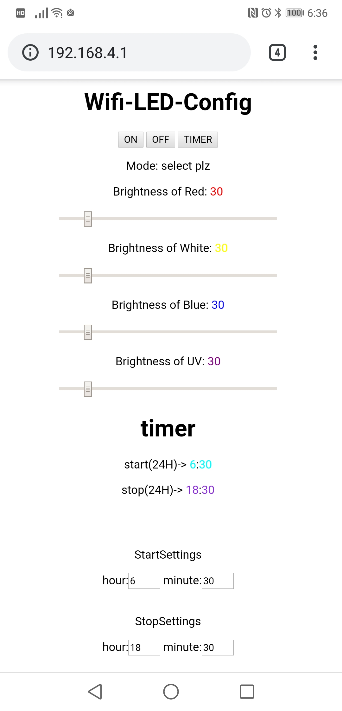

# wifiled

Wi-Fiを通してブラウザから操作できます。  
タイマーで特定の時間のみ点灯するように設定ができます。
LEDに複数のチャンネルがあり、赤、青、緑、紫外線、白の明るさをそれぞれ独立して制御できます。  
高周波・高電流対応のトランジスタを用いたPWMで制御しています。  
この後にスイッチを一つ追加し、WPSを利用してWi-Fiに接続する設定を自動化したのですが、そのソースコードが消滅しており古いバージョンのソースコードしか残っていませんでした。  

# 画像
裏側についているファンで冷却を行っている。画像は初期のもの。

上面  

操作画面

